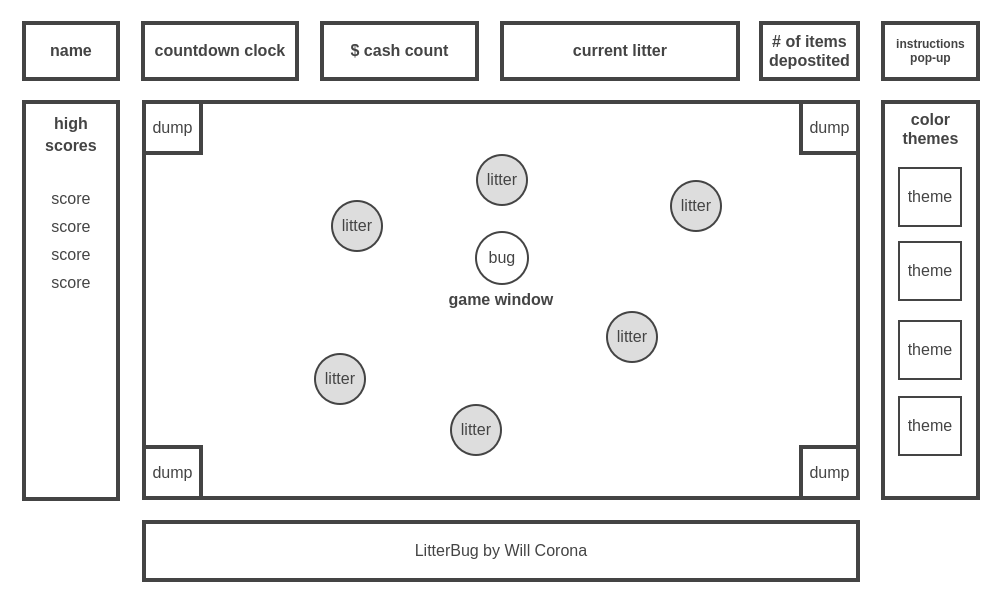

# *LitterBug*

## Description

***LitterBug*** is a **2D arcade-style game** where you are a trash-collecting **bug**, picking up up **litter** which appears randomly on the map. A Bug can carry **up to 5 pieces** of litter at a time and exchange the litter for **cash** at the **Dump** (placed in a corner of the map & respawning each time you visit).
Some litter will reward more money than others (i.e. a soda can is $1 but a pizza box is $5).  Let's see how much cash you can make before time runs out... Good luck!

## Live
[Let's Play Litterbug!](https://wcorona269.github.io/LitterBug/)

## Languages and Technologies
- Vanilla JavaScript
- HTML5/CSS3
- Canvas

## Game Anatomy

## Functionality & MVPs

***In Litterbug, users will be able to:***

- Input player name
- Read instructions from a pop-up window
- Use keyboard arrows to crawl around the map
- Collect litter & exchange it for cash at the Dump
    - Different litter types have different values
<!-- - The more rewarding a piece of litter is, the more it slows the bug down. -->

## Litter value chart
value | items | icon |
------------- | ------------- | ------------- |
$1  | water |
$1  | can | 
$2  | pop | 
$2  | beer | 
$3  | styrofoam cup | 
$3  | newspaper | 
$4  | box | 
$4  | jug | 
$5  | pizza | 
### In addition, this project will include:

- Windows displaying player name, countdown clock, cash count, current litter, and # of items deposited
- Access to more valuable litter (which will in turn slow the user down)
- Various color themes/settings to choose from (urban, suburban, rural)

## Wireframes

## Technologies, Libraries, APIs

***LitterBug*** requires a Canvas API to allow game functionality in the browser. It may potentially require a backend to save high scores.

## Implementation Timeline

**Friday Afternoon & Weekend:** Setup basic file structure & initial setup. Create classes for Bug, Litter & Dump. Render bug & litter.

**Monday:** Setup collision detection to allow bug to pick up litter & deposit in dump. Create pop-up window with game instructions. Get game rendered on screen with a moveable player & objects.

**Tuesday:** Create windows for countdown clock, cash total, current litter and deposits counter.

**Wednesday** Save scores to track high score. Allow for game restart.

**Thursday Morning** Visually improve game & add window for color theme options.

## Bonus Features
- Adding sound effects for collecting & dumping trash
    - Different sounds for each trash item picked up
    - "cha-ching" sound for dump visit
- different icons for the bug
- different game modes
    - fixed timer mode where you aim to get as much cash in a fixed time
    - 'survival' mode clock adds 5 seconds every time you visit the dump
- different color themes

### task list

- [x] setup basic project folder and skeleton
- [ ] render player dot on screen
- [ ] render randomly generated litter
- [ ] collision registers to remove litter from screen & add to current litter
- [ ] collision with dump adds cash & respawns dump
- [ ] render countdown clock
- [ ] render cash counter
- [ ] render deposit counter
- [ ] render deposit counter