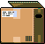

# LitterBug

## Description

**LitterBug** is a 2D retro arcade-style game where you play as a trash-collecting bug, picking up up litter which appears randomly on the map. Carry up to 5 pieces of litter at a time and exchange it for cash at the dump (placed in a corner of the map & respawning each time you visit). Let's see how much cash you can make before time runs out... Good luck! Oh, and watch out for the snakes!

Try it out for yourself here: [Let's Play Litterbug!](https://wcorona269.github.io/LitterBug/)

## Languages and Technologies
- Vanilla JavaScript
- HTML5/CSS3
- Canvas

## Assets Used
- [Recycle Items Set by Clint Bellanger](https://opengameart.org/content/recycle-items-set)
- [Grass background by Stereoscopic](https://opengameart.org/content/grass-1)
- [Insect Items by Admurin](https://admurin.itch.io/admurins-insects)
- ["Press Start 2P" Typeface by Google Fonts ](https://fonts.google.com/specimen/Press+Start+2P)
- All other image assets created by me

## Gameplay

### Welcome screen


### Respawn


### Game Over


## Functionality & MVPs
In Litterbug, users will be able to:

- Read instructions from a 'welcome' window
- Input player name
- Display player name, time remaining, cash, litter count, and # of deposits made
- Use keyboard (W,A,S,D) to move
- Pause game (spacebar)
- Collect litter & exchange for cash at the Dump
- Restart the game upon time or lives running out

## Litter value chart
**value** | **items** | **icon** |
------------- | ------------- | ------------- |
$1  | water |
$1  | can | 
$2  | pop | 
$2  | beer | 
$3  | styrofoam cup | 
$3  | newspaper | 
$4  | box | 
$4  | jug | 
$5  | pizza | 

## Code Snippets
### Collision Logic
```javascript
        checkCollisions() {
            const allObjects = this.allObjects();

            for (let i = 0; i < allObjects.length; i += 1) {
                for (let j = 0; j < allObjects.length; j += 1) {
                    if (i === j) continue;
                    const obj1 = allObjects[i];
                    const obj2 = allObjects[j];

                    if (obj1 instanceof Bug) {
                        if (obj2 instanceof Litter && this.belly.length < 5 && obj1.isCollidedWith(obj2)) {
                            this.belly.push(obj2);
                            this.remove(obj2);
                        } else if (obj2 instanceof Dump && obj1.isCollidedWith(obj2) && this.belly.length > 0) {
                            // this.dumpVisits += 1;
                            // visitsEl.innerHTML = this.dumpVisits;
                            this.dumpLitter();
                            this.addNewLitter();
                        } else if (obj2 instanceof Enemy && obj1.isCollidedWith(obj2)) {
                            this.lives--;
                            this.showRemainingLives()
                        }
                    } else if (obj1 instanceof Enemy) {
                        if (obj2 instanceof Enemy && obj1.isCollidedWith(obj2)) {
                            // keep enemies from morphing together
                            const obj1_x = obj1.pos[0];
                            const obj1_y = obj1.pos[1];
                            const obj2_x = obj2.pos[0];
                            const obj2_y = obj2.pos[1];

                            if (obj1_x > obj2_x) {
                                obj1.pos[0] += 2;
                                obj2.pos[1] -= 2;
                            } else {
                                obj2.pos[0] += 2;
                                obj1.pos[1] -= 2;
                            }

                            if (obj1_y > obj2_y) {
                                obj1.pos[1] += 2;
                                obj2.pos[1] -= 2;
                            } else {
                                obj2.pos[1] += 2;
                                obj1.pos[1] -= 2;
                            }           
                        }
                    }  
                }
            }
        }
```
### Enemy tracking logic
```javascript
	findBug(bug) {
		let pos = bug.pos;
		let x = pos[0] - this.pos[0];
		let y = pos[1] - this.pos[1];

		this.vel[0] = this.speed[this.speedIdx] * (x / Math.sqrt(Math.pow(x, 2) + Math.pow(y, 2)));
		this.vel[1] = this.speed[this.speedIdx] * (y / Math.sqrt(Math.pow(x, 2) + Math.pow(y, 2)));
	}
```

## Bonus Features
- Adding sound effects for collecting & dumping trash
- different icons for the bug
- different game modes
    - fixed timer mode where you aim to get as much cash in a fixed time
    - 'survival' mode clock adds 5 seconds every time you visit the dump
- different color themes